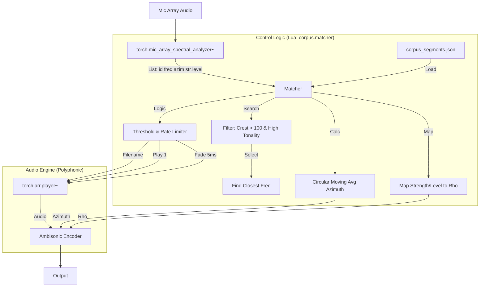

# System Design: Spectral Corpus Granulator

## 1. Overview
The system analyzes real-time audio from a microphone array, extracts spectral features (frequency, azimuth, strength), and uses this data to trigger and spatialize "musically similar" audio samples from a pre-analyzed corpus.

## 2. Architecture Diagram



## 3. Component Definitions

### A. Input Analysis (`torch.mic_array_spectral_analyzer~`)
*   **Role:** Provides the driving data.
*   **Output Format:** List per band: `<band_index> <azimuth> <strength> <level_db> <frequency>`
*   **Configuration:** Needs to be tuned to a refresh rate that allows the Lua script to keep up (e.g., 20-50ms).

### B. Corpus Manager & Logic (`corpus.matcher.pd_lua`)
This is a **new Lua object** we need to create. It acts as the bridge between analysis and playback.

#### 1. Corpus Data Structure (`corpus_segments.json`)
The JSON should look like this:
```json
[
  {
    "file": "absolute/path/to/sample_01.wav",
    "centroid": 440.0,
    "tonality": 0.95,
    "crest": 150.5,
    "duration": 2.5
  },
  ...
]
```

#### 2. Search Logic
*   **Filtering:** On load, create a subset of the corpus containing only items where `crest > 100` and `tonality > threshold`.
*   **Matching:** When a trigger occurs, perform a binary search (or efficient linear search) on the subset to find the sample with `centroid` closest to the input `frequency`.

#### 3. State & Smoothing Logic
*   **Circular Moving Average (Azimuth):**
    *   Since azimuth is circular (0° = 360°), simple averaging fails.
    *   *Algorithm:* Convert angles to Unit Vectors $(x, y) = (\cos\theta, \sin\theta)$. Average the vectors. Convert back to angle using `atan2(y, x)`.
*   **Parameter Mapping:**
    *   **Rho (Directionality):** Map `strength` (0.0 - 1.0) to Rho.
        *   Formula: `rho = strength ^ 0.5` (Square root curve to push towards directionality faster) or linear.
    *   **Gain:** Map `level_db` to linear gain.

#### 4. Trigger Logic
*   **Threshold:** Only trigger if `level_db > threshold`.
*   **Rate Limiting (Granulation Rate):**
    *   Parameter: `grains_per_sec` (e.g., 4 Hz).
    *   Logic: `min_interval = 1000 / grains_per_sec`. Ignore triggers if `current_time - last_trigger < min_interval`.

### C. Playback Engine (`torch.arr.player~`)
*   **Role:** Loads and plays the file selected by Lua.
*   **Configuration:**
    *   `@fade 5`: Set a default short fade (5ms) to prevent clicks during rapid re-triggering.
    *   `@ch 1`: Mono playback (spatialized later).
*   **Dynamic Loading:** Receives `open <filename>` message from Lua immediately followed by `play`.

### D. Spatialization (Ambisonics)
*   **Object:** Your existing Ambisonic encoder (e.g., `hoa.encoder~` or similar).
*   **Inputs:**
    *   Audio (from Player)
    *   Azimuth (from Lua smoothed output)
    *   Elevation (Fixed at 0 or derived)
    *   Rho (from Lua calculated output)

## 4. Data Flow Specification

1.  **Input:** `torch.mic_array_spectral_analyzer~` outputs list: `1 45.0 0.8 -12.0 442.0`.
2.  **Lua Processing (`in_1_list`):**
    *   Check if `-12.0 > threshold`.
    *   Check if `time_now > last_trigger + (1000/rate)`.
    *   **If Yes:**
        *   Search corpus for sample closest to `442.0 Hz` (with high crest/tonality).
        *   Update Azimuth Moving Average with `45.0`.
        *   Calculate `Rho = 0.8`.
        *   **Output:**
            *   Outlet 1: `open /path/to/match.wav`, `play` (To Player)
            *   Outlet 2: `azimuth <avg_angle>`, `rho <val>` (To Spatializer)
            *   Outlet 3: `gain <linear_vol>` (To Amplifier)

## 5. Implementation Plan

We will proceed in the following order:

1.  **JSON Preparation:** Ensure `corpus_segments.json` exists and has the required fields (`centroid`, `tonality`, `crest`).
2.  **Lua Object Creation (`corpus.matcher.pd_lua`):**
    *   Implement JSON loading.
    *   Implement the "Find Closest" algorithm.
    *   Implement the Circular Moving Average logic.
    *   Implement the Rate Limiter.
3.  **Pd Patching:**
    *   Create a `[clone]` abstraction (polyphony). Each clone instance represents one analysis band.
    *   Inside the clone: `[corpus.matcher] -> [torch.arr.player~] -> [ambisonic_encoder]`.
4.  **Integration:** Connect the analyzer to the clone object.
